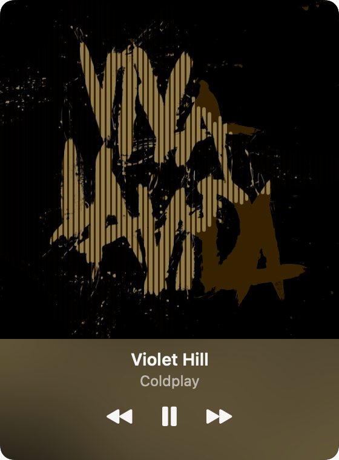
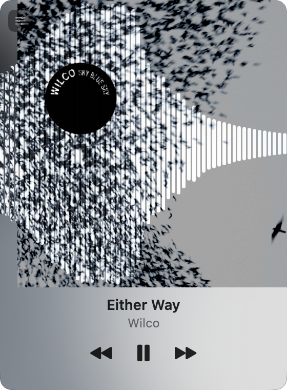
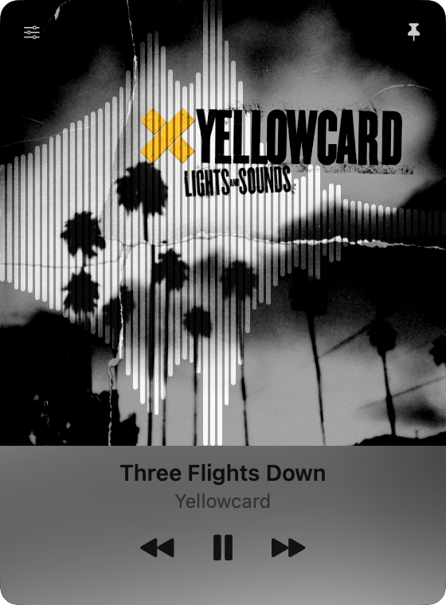

# Ditty

A minimal, floating Apple Music controller for macOS. Shows what's playing without the clutter.

  

<p align="center">
  
  
  
</p>

## What It Does

Ditty floats a small player on your desktop showing the current track — song title, artist, album artwork — with play/pause and skip controls. It talks to Music.app via AppleScript and taps its audio output for a real-time visualizer. No private APIs, no MusicKit.

## Features

- Current track: song title, artist, album artwork
- Play/pause, next/previous track controls
- Always-on-top floating window, toggleable
- Real-time audio visualizer via Core Audio Process Tap
- Minimal UI — shows what matters, nothing else

## Requirements

- macOS 14.2+ (Sonoma)
- Apple Music / Music.app
- Automation permission (controls Music.app)
- Screen & System Audio Recording permission (visualizer)

## Getting Started

```bash
git clone https://github.com/shaunandrews/ditty.git
cd ditty
swift build
```

Or open `Package.swift` in Xcode.

### Running

The app **must** be launched as a `.app` bundle — not by running the binary directly. TCC silently denies audio capture to bare binaries.

```bash
make run    # Build, codesign, and launch
```

This requires a local `DittyDev` self-signed code signing certificate. Create one via Keychain Access:

1. Open Keychain Access > Certificate Assistant > Create a Certificate
2. Name: `DittyDev`, Identity Type: Self Signed Root, Certificate Type: Code Signing
3. Click Create

## Project Structure

```
ditty/
├── Sources/Ditty/
│   ├── App.swift              # Entry point + floating window setup
│   ├── ContentView.swift      # Main player UI
│   ├── ControlsPanel.swift    # Playback controls
│   ├── MusicBridge.swift      # AppleScript bridge to Music.app
│   ├── AudioAnalyzer.swift    # Core Audio Process Tap + FFT
│   ├── VisualizerSettings.swift
│   └── Resources/             # App icon assets
├── Package.swift
├── Makefile
├── Info.plist
├── entitlements.plist
└── docs/
```

## Architecture

- **SwiftUI** app, built with Swift Package Manager
- **AppleScript bridge** for Music.app communication
- **NSPanel** floating window via AppDelegate
- **Core Audio Process Tap** for real-time audio visualization — taps Music.app's output directly (no microphone)
- **Polling model** — Music.app has no change notification API, so Ditty polls every second

## License

This project is licensed under the GNU General Public License v3.0. See [LICENSE](LICENSE) for details.
